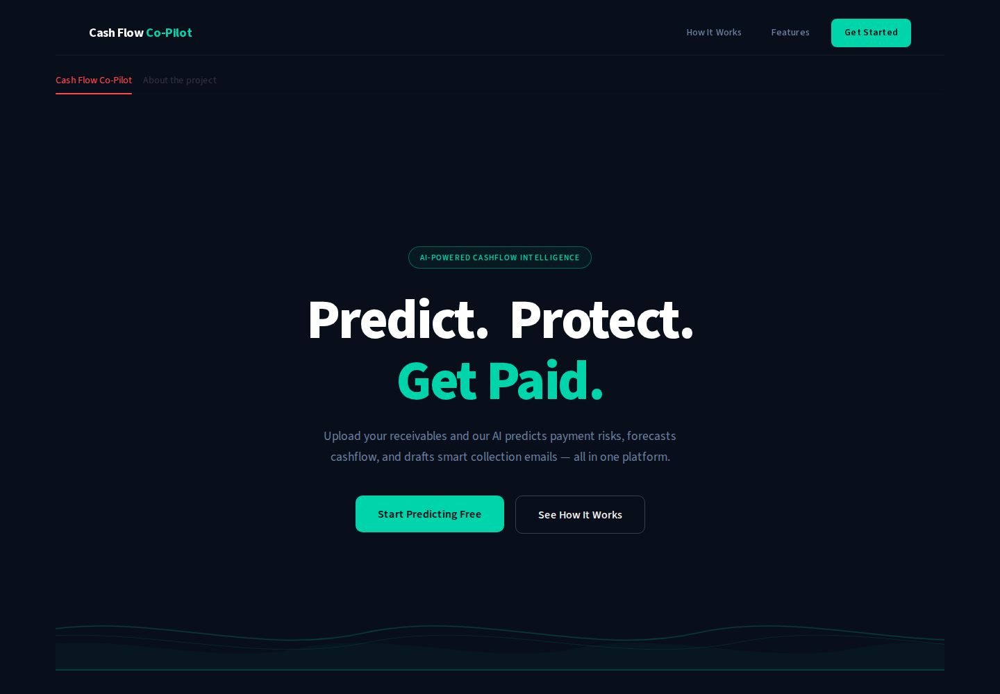
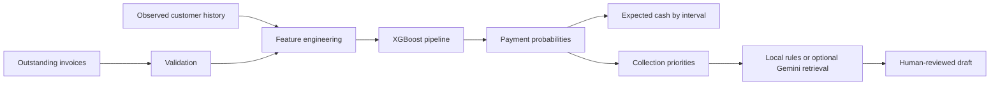

# CF Copilot
### Invoice payment timing · cash-flow forecasts · collection drafts

A team-built machine-learning application for exploring when outstanding invoices may be paid,
estimating expected receipts, and prioritising collection work. This portfolio edition adds a reproducible
synthetic demonstration, validated API inputs, temporal evaluation, and a complete local workflow.

**Built collaboratively:** Diogo Fernandes and teammates shared contributions across the project.
This repository is a portfolio adaptation of that team project.

## Try the demo

Python 3.11 is the tested runtime. No Kaggle, GCP, MLflow or Gemini credentials are required.

```bash
python3.11 -m venv .venv
source .venv/bin/activate
pip install -r requirements.lock.txt
python -m cf_copilot.demo
DEMO_MODE=1 EMAIL_PROVIDER=local_rules uvicorn cf_copilot.api.fast:app --port 8080
```

In a second terminal:

```bash
source .venv/bin/activate
streamlit run dashboard/app.py
```

Open [the dashboard](http://localhost:8501), click **Load sample invoices**, then **Generate forecast**,
**Run risk predictions**, and **Generate AI script**. The sample date is **2024-10-01**.
[Interactive API documentation](http://localhost:8080/docs) describes the endpoints.

Windows PowerShell: create the environment with Python, activate with
`.venv\Scripts\Activate.ps1`, and set `$env:DEMO_MODE="1"` before starting Uvicorn.
For a WSL checkout, run the Linux instructions inside WSL.

The first API startup prepares the synthetic model if its artifacts do not exist.
The demo is prominently labelled. Its email drafts use deterministic local rules;
they are not claimed to be generated by an LLM.

## Public portfolio hosting

See [deployment instructions](docs/deployment.md). The self-contained hosting entry point is portfolio_app.py.
The dashboard opens by default; **About the project** explains the problem, model choice, evaluation and limitations.

## Docker

```bash
docker compose up --build
```

Dashboard: port 8501. API: port 8080. Demo artifacts persist in a named volume.
No credential files are mounted. Docker configuration is supplied; consult [validation](docs/validation.md)
for what was actually exercised in this environment.

## Original dashboard

The course frontend is preserved, including its dark theme, typography, charts and four-step layout.
Functional fixes connect it to validated API responses and clear stale results when inputs change.



## What the application does

1. Validates invoice dates, identifiers, amounts and currencies.
2. Computes invoice timing and customer-history features using facts available at the reference date.
3. Uses a median-imputation + XGBoost pipeline to estimate seven payment intervals.
4. Aggregates expected cash as amount × interval probability.
5. Ranks invoices with a transparent collections heuristic.
6. Produces a collection draft for human review, with an explicitly named provider.



## Input contract

| Column | Meaning |
|---|---|
| doc_id | Unique invoice identifier, preserved as text |
| cust_number | Customer identifier, preserved as text |
| total_open_amount | Finite, non-negative amount |
| invoice_sent | Issue date: ISO or YYYYMMDD |
| due_in_date | Due date: ISO or YYYYMMDD |
| name_customer | Optional display name |
| invoice_currency | Optional USD/CAD; defaults to USD |
| invoice_paid | Optional payment date; paid invoices are rejected for inference |

Legacy dataset names `baseline_create_date` and `clear_date` are also supported.
Limit: 5 MB and 10,000 rows per inference upload. Duplicate IDs are rejected.
The API normalizes amounts to USD; CAD rates are approximate historical assumptions, documented in the model card.

Buckets: **1–7 days, 8–14, 15–21, 22–28, 29–35, 36–42, 43+**.
The last bucket is an open-ended tail, not a promise of payment during a seventh week.

```bash
curl -X POST http://localhost:8080/predict   -F file=@raw_data/demo/invoices.csv   -F reference_date=2024-10-01
```

| Method | Endpoint | Result |
|---|---|---|
| GET | /health | Model availability, demo mode, provider, reference date |
| GET | /model-info | Bucket definitions and synthetic evaluation metadata |
| GET | /demo/invoices | Download the synthetic sample |
| POST | /predict | Invoice IDs, predicted intervals, probabilities |
| POST | /predict_cashflow | Expected cash across six weeks and the 43+ day tail |
| POST | /prioritise_invoices | Top ten priorities with transparent scores |
| POST | /rag_script | A draft; no email is sent |

Malformed data returns 422, oversized files return 413, and an unavailable model returns 503.
API failures never produce random mock predictions.

## Evaluation and limitations

The synthetic demonstration uses a temporal holdout with **only payment labels known by the training cutoff**.
It compares XGBoost with a class-prior baseline and reports classification and cash-flow errors.
See [recorded metrics](docs/demo_metrics.json) and the [model card](docs/model_card.md).

Synthetic results demonstrate engineering behavior, not customer outcomes or real-world generalization.
The historical research dataset is linked in the model card. No unsupported improvement percentages are claimed.
There is no fitted probability calibration, uncertainty interval, default prediction, or automated email delivery.

## Historical data and optional integrations

```bash
pip install -r requirements_cloud.txt
cp .env.sample .env
# Configure MODEL_TARGET, CURRENT_DATE and any optional service credentials.
# Place the historical dataset at raw_data/dataset.csv.
python -m cf_copilot.interface.main
# Start inference with DEMO_MODE=0 after training.
```

Historical training consumes the raw Kaggle invoice dataset and saves local model/history artifacts.
Training includes classification and six-week cash-flow backtests. Cutoffs use reference dates;
training excludes outcomes unavailable at each cutoff. Sparse folds without all seven classes are skipped.

For optional Gemini drafts, set `EMAIL_PROVIDER=gemini_rag` and `GEMINI_API_KEY`,
then build the store with `python -m cf_copilot.rag.script_generator`.
Example playbooks are tracked under `data/playbook/`; the generated vector store is private.
No cloud service is called by the default demo or tests.

## Development

```bash
pip install -r requirements_dev.txt
python -m pytest
ruff check cf_copilot dashboard tests
```

Run the development commands above for regression tests and syntax-oriented lint checks.
The CI workflow is prepared locally but omitted from this deployment branch because the connected GitHub token lacks workflow scope.
Tests cover row identity, currency normalization, bucket boundaries, temporal label availability,
API errors, and Streamlit state changes. Runtime artifacts and credentials are ignored by Git.

## Repository guide

- `cf_copilot/` — API, ML pipeline, forecasting, collection ranking, optional RAG.
- `dashboard/app.py` — complete Streamlit workflow.
- `tests/` — regression and application tests.
- `docs/` — model card, portfolio case study, validation and recorded demo metrics.
- `notebooks/` — original collaborative research; see its index.
- `data/playbook/` — example collection policies.
- `raw_data/` — private local datasets and generated artifacts.
- `.backups/` — local pre-change backup and archived drafts; never publish.

## Attribution and licensing

This is a collaborative project with shared contributions. The portfolio adaptation does not
claim sole authorship. No open-source license has been selected; repository visibility does not
grant a new redistribution license. Agree licensing with the contributors before licensing the shared code.
